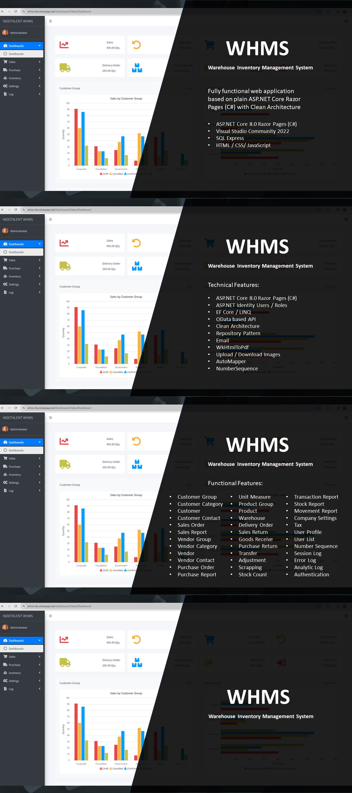

# Introduction
Welcome to our Warehouse Inventory Management System (WHMS), a cutting-edge solution designed to revolutionize your inventory operations. Powered by ASP.NET Core 8.0 Razor Pages, WHMS offers a comprehensive suite of features including Sales, Purchase, Delivery, Goods Received, Transfer, Adjustment, Return, Scrapping, Stock Count, Transaction Report, Movement Report, and Stock Report. Seamlessly manage your warehouse inventory with ease & precision, ensuring optimal stock levels, streamlined workflows, and enhanced productivity. Experience the future of inventory management with WHMS – your ultimate tool for operational excellence.

# Technical Features
- ASP.NET Core 8.0 Razor Pages 
- ASP.NET Identity Users / Roles
- EF Core / LINQ
- OData-based API (Server side: paging, filter, search, sort)
- Clean Architecture
- Repository Pattern
- Email
- WkHtmlToPdf
- Upload / Download Images
- AutoMapper
- number sequence

# Functional Features
- Customer Group
- Customer Category
- Customer
- Customer Contact
- Sales Order
- Sales Report
- Vendor Group
- Vendor Category
- Vendor
- Vendor Contact
- Purchase Order
- Purchase Report
- Unit Measure
- Product Group
- Product
- Warehouse
- Delivery Order
- Sales Return
- Goods Receive
- Purchase Return
- Transfer
- Adjustment
- Scrapping
- Stock Count
- Transaction Report
- Stock Report
- Movement Report
- Company Settings
- Tax
- User Profile
- User List
- Number Sequence
- Error-Log
- Analytic Log
- Authentication / Membership

# Live Demo Link
<!-- - Url: [https://whms-lte.csharpasp.net/] (https://whms-lte.csharpasp.net/) -->
- Username: admin@gmail.com
- Password: 123456

# Credit
- Syncfusion Community License for UI Control. [https://www.syncfusion.com/products/communitylicense](https://www.syncfusion.com/products/communitylicense) 
- AdminLTE for HTML Admin Template. [https://adminlte.io/](https://adminlte.io/)
